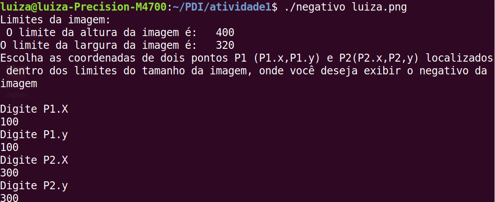
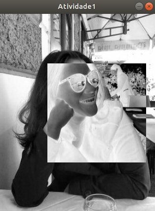
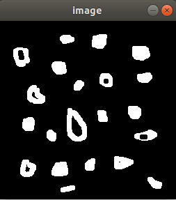
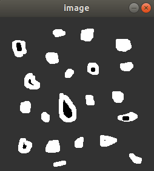
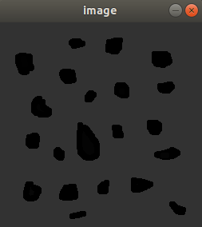

# Página para apresentação dos exercícios da disciplina [DCA0445](https://agostinhobritojr.github.io/curso/pdi/)
## PROCESSAMENTO DIGITAL DE IMAGENS (PDI)
Professor: [Agostinho Brito](https://agostinhobritojr.github.io)
Aluno: Josiel Patricio Pereira de Oliveira
##  - 2019.1

# Compilar e executar os códigos

Para compilar e executar os códigos basta executar a sequência de comandos listada que será explicada em seguida.

```Makefile
make <Nome_do_arquivo_cpp>
./<Nome_do_arquivo_cpp>
```

A primeira linha usa o aplicativo make para compilar o arquivo do código fonte. <Nome_do_arquivo_cpp> refere-se ao código escrito na linguagem C++.
Na segunda linha temos a execução do programa. Em alguns casos é necessário passar argumentos necessários para o correto funcionamento da aplicação desenvolvida, isso pode ser feito adicionando os parametros após o nome do programa a ser executado.

```
./<Nome_do_arquivo_cpp> <parametro_necessario>
```

# Regiões

Utilizamos o programa exemplos/pixels.cpp como referência, e implementamos um programa que indica ao usuário os limites do tamanho da imagem, e depois solicita ao mesmo as coordenadas de dois pontos. 

Depois exibimos a imagem com seguinte alteração: a região definida pelo retângulo de vértices opostos definidos pelos pontos P1 e P2 será exibida com o negativo da imagem na região correspondente.
``` C++ 
#include <iostream>
#include <opencv2/opencv.hpp>

using namespace cv;
using namespace std;


int main()
{
  Mat image;
  int x0,x1,y0,y1;


image= imread("luiza.png",CV_LOAD_IMAGE_GRAYSCALE);
  if(!image.data)
    cout << "nao abriu luiza.png" << endl;

/*
Esse programa deverá solicitar ao usuário as coordenadas de dois pontos P1 e P2 localizados dentro dos limites do tamanho da imagem e exibir que lhe for fornecida.
*/


// Vamos mostrar ao usuario os limites da imagem utilizada

cout<<"Limites da imagem:"<<endl;
cout<<" O limite da altura da imagem é:   "<<image.rows<<endl;
cout<<"O limite da largura da imagem é:   "<<image.cols<<endl;

cout<<"Escolha as coordenadas de dois pontos P1 (P1.x,P1.y) e P2(P2.x,P2,y) localizados dentro dos limites do tamanho da imagem, onde você deseja exibir o negativo da imagem"<<endl<<endl;
cout<<"Digite P1.X" <<endl;
cin>>x0;
cout<<"Digite P1.y"<<endl;
cin>>y0;
cout<<"Digite P2.X"<<endl;
cin>>x1;
cout<<"Digite P2.y"<<endl;
cin>>y1;

 namedWindow("Atividade1",WINDOW_AUTOSIZE);

  for(int i = y0; i < y1; i++){
    for(int j = x0;j < x1; j++){
      image.at<uchar>(i,j)=255-image.at<uchar>(i,j);
    }
  }
			   
imshow("Atividade1",image);
waitKey();

return 0;
}

```

  
figura 01: imagem original

  
figura 02: pontos usados para gerar a saída a seguir.

  
figura 03: imagem com parte em nagativo


Para atingirmos esse objetivo, a seguinte fórmula foi usada: 
``` C++
image.at<uchar>(i,j)=255-image.at<uchar>(i,j);
```


# Troca de Regiões

Utilizamos o programa exemplos/pixels.cpp como referência, e implementamos um programa que troca os quadrantes em diagonal da imagem. Exploramos o uso da classe Mat e seus construtores para criar as regiões a serem trocadas. 

```C++
#include <iostream>
#include <opencv2/opencv.hpp>

using namespace cv;
using namespace std;

int main(int, char** argv)
{

Mat image,image2;
Mat primeiroquad,segquad,tercequad,quartoquad;
Mat primeiroquad2,segquad2,tercequad2,quartoquad2;
image= imread("biel.png",CV_LOAD_IMAGE_GRAYSCALE);
  if(!image.data)
      cout << "nao abriu biel.png" << endl;

namedWindow("janela",WINDOW_AUTOSIZE);


primeiroquad= image(Rect(0,0,image.rows/2,image.cols/2));
segquad=image(Rect(0,image.cols/2,image.rows/2,image.cols/2));
tercequad=image(Rect(image.rows/2,0,image.rows/2,image.cols/2));
quartoquad=image(Rect(image.rows/2,image.cols/2,image.rows/2,image.cols/2));


image2=image.clone();

primeiroquad2= image2(Rect(0,0,image.rows/2,image.cols/2));
segquad2=image2(Rect(0,image.cols/2,image.rows/2,image.cols/2));
tercequad2=image2(Rect(image.rows/2,0,image.rows/2,image.cols/2));
quartoquad2=image2(Rect(image.rows/2,image.cols/2,image.rows/2,image.cols/2));

primeiroquad.copyTo(quartoquad2);
segquad.copyTo(tercequad2);
tercequad.copyTo(segquad2);
quartoquad.copyTo(primeiroquad2);


imshow("janela",image);
waitKey();
imshow("janela",image2);
waitKey();
return 0;
}
```


# Labeling

Utilizamos o programa labeling.cpp como referência, e identificamos quantas bolhas com ou sem buracos internos existem na cena, sem contar as bolhas que tocam as bordas da imagem. 

Fizemos o seguinte passo a passo: 

1. Retiramos as bolhas das bordas
2. Mudamos o fundo para cinza 
3. Contamos e dizemos quantas bolhas tem com buracos 
4. Colorimos todas as bolhas de preto (e assim "acabamos" com os buracos)
5. Fizemos a contagem de quantas bolhas possuem na cena, independente se no inicio possuiam ou não buracos

```C++
#include <iostream>
#include <opencv2/opencv.hpp>

using namespace cv;

int main(int argc, char** argv){
  Mat image,image2;
  int width, height,nobjects,buraco;
  nobjects=0;
  buraco=0;
CvPoint p;
p.x=0;
p.y=0;

image = imread(argv[1],CV_LOAD_IMAGE_GRAYSCALE);

if(!image.data){
    std::cout << "imagem nao carregou corretamente\n";
    return(-1);
  }

// Retiramos as bolhas das bordas

width=image.size().width;
 height=image.size().height;

 for (int j=0;j<width;j++){
    image.at<uchar>(0,j)=255;
   image.at<uchar>(height-1,j)=255;
  }
  for (int i=0;i<height;i++){
    image.at<uchar>(i,0)=255;
    image.at<uchar>(i,width-1)=255;
  }

 floodFill(image,p,0);

// Mudaremos o fundo para cinza 
floodFill(image,p,50);

// Contamos e dizemos quantas bolhas tem com buracos  
  for(int i=0; i<height; i++){
    for(int j=0; j<width; j++){
      if(image.at<uchar>(i,j) == 0){
	//// achou um objeto
		buraco++;
		p.x=j;
		p.y=i;
		floodFill(image,p,buraco);
	  }
	}
  }

 // Colorimos todas as bolhas de preto (e assim "acabamos" com os buracos)
 for(int i=0; i < height; ++i){
    for(int j=0; j < width; ++j){
      if(image.at<uchar>(i, j) == 255){
        p.x=j;
        p.y=i;
        floodFill(image, p, 0);
      }
    }
  }
// Fazemos a contagem de quantas bolhas possuem na cena, independente se no inicio possuiam ou não buracos

for(int i=0; i<height; i++){
  for(int j=0; j<width; j++){
    if(image.at<uchar>(i,j) == 0){
      nobjects=nobjects+1;
      p.x=j;
      p.y=i;
      floodFill(image,p,nobjects);
    }
  }
}


std:: cout<<nobjects<<std::endl;
std:: cout<<buraco<<std::endl;
image.copyTo(image2);

imshow("image", image2);
 waitKey();
  return 0;
}
```
  
figura 04: imagem original

  
figura 05: sem objetos das bordas.

  
figura 06: com alteração do rótulo do funto

  
figura 07: imagem com todos os objetos marcados

# Equalize


```C++
```

# Detecção de Movimento


```C++
```

# Filtro Espacial I


```C++
```

# TiltShift


```C++
```


<!--
You can use the [editor on GitHub](https://github.com/apenaz/Processamento-Digital-de-Imagens/edit/master/index.md) to maintain and preview the content for your website in Markdown files.

Whenever you commit to this repository, GitHub Pages will run [Jekyll](https://jekyllrb.com/) to rebuild the pages in your site, from the content in your Markdown files.

### Markdown

Markdown is a lightweight and easy-to-use syntax for styling your writing. It includes conventions for

```markdown
Syntax highlighted code block

# Header 1
## Header 2
### Header 3

- Bulleted
- List

1. Numbered
2. List

**Bold** and _Italic_ and `Code` text

[Link](url) and 
```

For more details see [GitHub Flavored Markdown](https://guides.github.com/features/mastering-markdown/).

### Jekyll Themes

Your Pages site will use the layout and styles from the Jekyll theme you have selected in your [repository settings](https://github.com/apenaz/Processamento-Digital-de-Imagens/settings). The name of this theme is saved in the Jekyll `_config.yml` configuration file.

### Support or Contact

Having trouble with Pages? Check out our [documentation](https://help.github.com/categories/github-pages-basics/) or [contact support](https://github.com/contact) and we’ll help you sort it out.
-->
