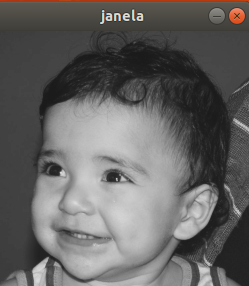
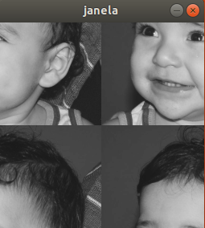

# Página para apresentação dos exercícios da disciplina [DCA0445](https://agostinhobritojr.github.io/curso/pdi/)
## PROCESSAMENTO DIGITAL DE IMAGENS (PDI)
Professor: [Agostinho Brito](https://agostinhobritojr.github.io)


Alunos:<br>
Josiel Patricio Pereira de Oliveira<br>
Tramontin Santiago


##  - 2019.1

# Compilar e executar os códigos

Para compilar e executar os códigos basta executar a sequência de comandos listada que será explicada em seguida.

```Makefile
make <Nome_do_arquivo_cpp>
./<Nome_do_arquivo_cpp>
```

A primeira linha usa o aplicativo make para compilar o arquivo do código fonte. <Nome_do_arquivo_cpp> refere-se ao código escrito na linguagem C++.
Na segunda linha temos a execução do programa. Em alguns casos é necessário passar argumentos necessários para o correto funcionamento da aplicação desenvolvida, isso pode ser feito adicionando os parametros após o nome do programa a ser executado.

```
./<Nome_do_arquivo_cpp> <parametro_necessario>
```

# Regiões

Utilizamos o programa exemplos/pixels.cpp como referência, e implementamos um programa que indica ao usuário os limites do tamanho da imagem, e depois solicita ao mesmo as coordenadas de dois pontos. 

Depois exibimos a imagem com seguinte alteração: a região definida pelo retângulo de vértices opostos definidos pelos pontos P1 e P2 será exibida com o negativo da imagem na região correspondente.
``` C++ 
#include <iostream>
#include <opencv2/opencv.hpp>

using namespace cv;
using namespace std;


int main()
{
  Mat image;
  int x0,x1,y0,y1;


image= imread("luiza.png",CV_LOAD_IMAGE_GRAYSCALE);
  if(!image.data)
    cout << "nao abriu luiza.png" << endl;

/*
Esse programa deverá solicitar ao usuário as coordenadas de dois pontos P1 e P2 localizados dentro dos limites do tamanho da imagem e exibir que lhe for fornecida.
*/


// Vamos mostrar ao usuario os limites da imagem utilizada

cout<<"Limites da imagem:"<<endl;
cout<<" O limite da altura da imagem é:   "<<image.rows<<endl;
cout<<"O limite da largura da imagem é:   "<<image.cols<<endl;

cout<<"Escolha as coordenadas de dois pontos P1 (P1.x,P1.y) e P2(P2.x,P2,y) localizados dentro dos limites do tamanho da imagem, onde você deseja exibir o negativo da imagem"<<endl<<endl;
cout<<"Digite P1.X" <<endl;
cin>>x0;
cout<<"Digite P1.y"<<endl;
cin>>y0;
cout<<"Digite P2.X"<<endl;
cin>>x1;
cout<<"Digite P2.y"<<endl;
cin>>y1;

 namedWindow("Atividade1",WINDOW_AUTOSIZE);

  for(int i = y0; i < y1; i++){
    for(int j = x0;j < x1; j++){
      image.at<uchar>(i,j)=255-image.at<uchar>(i,j);
    }
  }
			   
imshow("Atividade1",image);
waitKey();

return 0;
}

```

  
figura 01: imagem original

  
figura 02: pontos usados para gerar a saída a seguir.

  
figura 03: imagem com parte em nagativo


Para atingirmos esse objetivo, a seguinte fórmula foi usada: 
``` C++
image.at<uchar>(i,j)=255-image.at<uchar>(i,j);
```


# Troca de Regiões

Utilizamos o programa exemplos/pixels.cpp como referência, e implementamos um programa que troca os quadrantes em diagonal da imagem. Exploramos o uso da classe Mat e seus construtores para criar as regiões a serem trocadas. 

```C++
#include <iostream>
#include <opencv2/opencv.hpp>

using namespace cv;
using namespace std;

int main(int, char** argv)
{

Mat image,image2;
Mat primeiroquad,segquad,tercequad,quartoquad;
Mat primeiroquad2,segquad2,tercequad2,quartoquad2;
image= imread("biel.png",CV_LOAD_IMAGE_GRAYSCALE);
  if(!image.data)
      cout << "nao abriu biel.png" << endl;

namedWindow("janela",WINDOW_AUTOSIZE);


primeiroquad= image(Rect(0,0,image.rows/2,image.cols/2));
segquad=image(Rect(0,image.cols/2,image.rows/2,image.cols/2));
tercequad=image(Rect(image.rows/2,0,image.rows/2,image.cols/2));
quartoquad=image(Rect(image.rows/2,image.cols/2,image.rows/2,image.cols/2));


image2=image.clone();

primeiroquad2= image2(Rect(0,0,image.rows/2,image.cols/2));
segquad2=image2(Rect(0,image.cols/2,image.rows/2,image.cols/2));
tercequad2=image2(Rect(image.rows/2,0,image.rows/2,image.cols/2));
quartoquad2=image2(Rect(image.rows/2,image.cols/2,image.rows/2,image.cols/2));

primeiroquad.copyTo(quartoquad2);
segquad.copyTo(tercequad2);
tercequad.copyTo(segquad2);
quartoquad.copyTo(primeiroquad2);


imshow("janela",image);
waitKey();
imshow("janela",image2);
waitKey();
return 0;
}
```

Com o código acima obtivemos os seguintes resultados

  
figura 04: imagem original

  
figura 05: imagem com regiões trocas.

# Labeling

Utilizamos o programa labeling.cpp como referência, e identificamos quantas bolhas com ou sem buracos internos existem na cena, sem contar as bolhas que tocam as bordas da imagem. 

Fizemos o seguinte passo a passo: 

1. Retiramos as bolhas das bordas
2. Mudamos o fundo para cinza 
3. Contamos e dizemos quantas bolhas tem com buracos 
4. Colorimos todas as bolhas de preto (e assim "acabamos" com os buracos)
5. Fizemos a contagem de quantas bolhas possuem na cena, independente se no inicio possuiam ou não buracos

```C++
#include <iostream>
#include <opencv2/opencv.hpp>

using namespace cv;

int main(int argc, char** argv){
  Mat image,image2;
  int width, height,nobjects,buraco;
  nobjects=0;
  buraco=0;
CvPoint p;
p.x=0;
p.y=0;

image = imread(argv[1],CV_LOAD_IMAGE_GRAYSCALE);

if(!image.data){
    std::cout << "imagem nao carregou corretamente\n";
    return(-1);
  }

// Retiramos as bolhas das bordas

width=image.size().width;
 height=image.size().height;

 for (int j=0;j<width;j++){
    image.at<uchar>(0,j)=255;
   image.at<uchar>(height-1,j)=255;
  }
  for (int i=0;i<height;i++){
    image.at<uchar>(i,0)=255;
    image.at<uchar>(i,width-1)=255;
  }

 floodFill(image,p,0);

// Mudaremos o fundo para cinza 
floodFill(image,p,50);

// Contamos e dizemos quantas bolhas tem com buracos  
  for(int i=0; i<height; i++){
    for(int j=0; j<width; j++){
      if(image.at<uchar>(i,j) == 0){
	//// achou um objeto
		buraco++;
		p.x=j;
		p.y=i;
		floodFill(image,p,buraco);
	  }
	}
  }

 // Colorimos todas as bolhas de preto (e assim "acabamos" com os buracos)
 for(int i=0; i < height; ++i){
    for(int j=0; j < width; ++j){
      if(image.at<uchar>(i, j) == 255){
        p.x=j;
        p.y=i;
        floodFill(image, p, 0);
      }
    }
  }
// Fazemos a contagem de quantas bolhas possuem na cena, independente se no inicio possuiam ou não buracos

for(int i=0; i<height; i++){
  for(int j=0; j<width; j++){
    if(image.at<uchar>(i,j) == 0){
      nobjects=nobjects+1;
      p.x=j;
      p.y=i;
      floodFill(image,p,nobjects);
    }
  }
}


std:: cout<<nobjects<<std::endl;
std:: cout<<buraco<<std::endl;
image.copyTo(image2);

imshow("image", image2);
 waitKey();
  return 0;
}
```
  
figura 06: imagem original

  
figura 07: sem objetos das bordas.

  
figura 08: com alteração do rótulo do funto

  
figura 09: imagem com todos os objetos marcados
<!--
# Equalize


```C++
```

# Detecção de Movimento


```C++
```

# Filtro Espacial I


```C++
```

# TiltShift


```C++
```
-->
# Filtragem no domínio da frequência

Esta seção tem o objetivo de demonstrar a filtragem no domínio da frequência. Entretanto para mudar do domínio espacial para o domínio da frequêcia precisamos utilizar uma ferramenta matemática chamada Transformada de Fourier, esta ferramenta será apresentada a seguir.

Utilizando a transformada de Fourier é possível decompor um sinal contínuo em uma combinação de funções senoidais ponderadas por coeficientes.
Para o caso que trataremos aqui, imagens digitais, utilizamos a Transformada Discreta  de Fourier (DFT), ela fornece uma representação alternativa da imagem digital tornando mais evidente os ruidos periódicos presentes na imagem.

o processo de filtragem ... espacial transformada filtro espacial na tranformada... transformada inversa... imagem filtrada...


```C++
#include <iostream>
#include <opencv2/opencv.hpp>

#define RADIUS 20

using namespace cv;
using namespace std;

// troca os quadrantes da imagem da DFT
void deslocaDFT(Mat& image ){
  Mat tmp, A, B, C, D;

  // se a imagem tiver tamanho impar, recorta a regiao para
  // evitar cópias de tamanho desigual
  image = image(Rect(0, 0, image.cols & -2, image.rows & -2));
  int cx = image.cols/2;
  int cy = image.rows/2;

  // reorganiza os quadrantes da transformada
  // A B   ->  D C
  // C D       B A
  A = image(Rect(0, 0, cx, cy));
  B = image(Rect(cx, 0, cx, cy));
  C = image(Rect(0, cy, cx, cy));
  D = image(Rect(cx, cy, cx, cy));

  // A <-> D
  A.copyTo(tmp);  D.copyTo(A);  tmp.copyTo(D);

  // C <-> B
  C.copyTo(tmp);  B.copyTo(C);  tmp.copyTo(B);
}

int main(int , char**){
  VideoCapture cap;
  Mat imaginaryInput, complexImage, multsp;
  Mat padded, filter, mag;
  Mat image, imagegray, tmp;
  Mat_<float> realInput, zeros;
  vector<Mat> planos;

  // habilita/desabilita ruido
  int noise=0;
  // frequencia do ruido
  int freq=10;
  // ganho inicial do ruido
  float gain=1;

  // valor do ruido
  float mean;

  // guarda tecla capturada
  char key;

  // valores ideais dos tamanhos da imagem
  // para calculo da DFT
  int dft_M, dft_N;

  // abre a câmera default
  cap.open(0);
  if(!cap.isOpened())
    return -1;

  // captura uma imagem para recuperar as
  // informacoes de gravação
  cap >> image;

  // identifica os tamanhos otimos para
  // calculo do FFT
  dft_M = getOptimalDFTSize(image.rows);
  dft_N = getOptimalDFTSize(image.cols);

  // realiza o padding da imagem
  copyMakeBorder(image, padded, 0,
                 dft_M - image.rows, 0,
                 dft_N - image.cols,
                 BORDER_CONSTANT, Scalar::all(0));

  // parte imaginaria da matriz complexa (preenchida com zeros)
  zeros = Mat_<float>::zeros(padded.size());

  // prepara a matriz complexa para ser preenchida
  complexImage = Mat(padded.size(), CV_32FC2, Scalar(0));

  // a função de transferência (filtro frequencial) deve ter o
  // mesmo tamanho e tipo da matriz complexa
  filter = complexImage.clone();

  // cria uma matriz temporária para criar as componentes real
  // e imaginaria do filtro ideal
  tmp = Mat(dft_M, dft_N, CV_32F);

  // prepara o filtro passa-baixas ideal
  for(int i=0; i<dft_M; i++){
    for(int j=0; j<dft_N; j++){
      if((i-dft_M/2)*(i-dft_M/2)+(j-dft_N/2)*(j-dft_N/2) < RADIUS*RADIUS){
        tmp.at<float> (i,j) = 1.0;
      }
    }
  }

  // cria a matriz com as componentes do filtro e junta
  // ambas em uma matriz multicanal complexa
  Mat comps[]= {tmp, tmp};
  merge(comps, 2, filter);

  for(;;){
    cap >> image;
    cvtColor(image, imagegray, CV_BGR2GRAY);
    imshow("original", imagegray);

    // realiza o padding da imagem
    copyMakeBorder(imagegray, padded, 0,
                   dft_M - image.rows, 0,
                   dft_N - image.cols,
                   BORDER_CONSTANT, Scalar::all(0));

    // limpa o array de matrizes que vao compor a
    // imagem complexa
    planos.clear();
    // cria a compoente real
    realInput = Mat_<float>(padded);
    // insere as duas componentes no array de matrizes
    planos.push_back(realInput);
    planos.push_back(zeros);

    // combina o array de matrizes em uma unica
    // componente complexa
    merge(planos, complexImage);

    // calcula o dft
    dft(complexImage, complexImage);

    // realiza a troca de quadrantes
    deslocaDFT(complexImage);

    // aplica o filtro frequencial
    mulSpectrums(complexImage,filter,complexImage,0);

    // limpa o array de planos
    planos.clear();
    // separa as partes real e imaginaria para modifica-las
    split(complexImage, planos);

    // usa o valor medio do espectro para dosar o ruido
    mean = abs(planos[0].at<float> (dft_M/2,dft_N/2));

    // insere ruido coerente, se habilitado
    if(noise){
      // F(u,v) recebe ganho proporcional a F(0,0)
      planos[0].at<float>(dft_M/2 +freq, dft_N/2 +freq) +=
        gain*mean;

      planos[1].at<float>(dft_M/2 +freq, dft_N/2 +freq) +=
        gain*mean;

      // F*(-u,-v) = F(u,v)
      planos[0].at<float>(dft_M/2 -freq, dft_N/2 -freq) =
        planos[0].at<float>(dft_M/2 +freq, dft_N/2 +freq);

      planos[1].at<float>(dft_M/2 -freq, dft_N/2 -freq) =
        -planos[1].at<float>(dft_M/2 +freq, dft_N/2 +freq);

    }

    // recompoe os planos em uma unica matriz complexa
    merge(planos, complexImage);

    // troca novamente os quadrantes
    deslocaDFT(complexImage);

	cout << complexImage.size().height << endl;
    // calcula a DFT inversa
    idft(complexImage, complexImage);

    // limpa o array de planos
    planos.clear();

    // separa as partes real e imaginaria da
    // imagem filtrada
    split(complexImage, planos);

    // normaliza a parte real para exibicao
    normalize(planos[0], planos[0], 0, 1, CV_MINMAX);
    imshow("filtrada", planos[0]);

    key = (char) waitKey(10);
    if( key == 27 ) break; // esc pressed!
    switch(key){
      // aumenta a frequencia do ruido
    case 'q':
      freq=freq+1;
      if(freq > dft_M/2-1)
        freq = dft_M/2-1;
      break;
      // diminui a frequencia do ruido
    case 'a':
      freq=freq-1;
      if(freq < 1)
        freq = 1;
      break;
      // amplifica o ruido
    case 'x':
      gain += 0.1;
      break;
      // atenua o ruido
    case 'z':
      gain -= 0.1;
      if(gain < 0)
        gain=0;
      break;
      // insere/remove ruido
    case 'e':
      noise=!noise;
      break;
    }
  }
  return 0;
}
```

<!--
You can use the [editor on GitHub](https://github.com/apenaz/Processamento-Digital-de-Imagens/edit/master/index.md) to maintain and preview the content for your website in Markdown files.

Whenever you commit to this repository, GitHub Pages will run [Jekyll](https://jekyllrb.com/) to rebuild the pages in your site, from the content in your Markdown files.

### Markdown

Markdown is a lightweight and easy-to-use syntax for styling your writing. It includes conventions for

```markdown
Syntax highlighted code block

# Header 1
## Header 2
### Header 3

- Bulleted
- List

1. Numbered
2. List

**Bold** and _Italic_ and `Code` text

[Link](url) and 
```

For more details see [GitHub Flavored Markdown](https://guides.github.com/features/mastering-markdown/).

### Jekyll Themes

Your Pages site will use the layout and styles from the Jekyll theme you have selected in your [repository settings](https://github.com/apenaz/Processamento-Digital-de-Imagens/settings). The name of this theme is saved in the Jekyll `_config.yml` configuration file.

### Support or Contact

Having trouble with Pages? Check out our [documentation](https://help.github.com/categories/github-pages-basics/) or [contact support](https://github.com/contact) and we’ll help you sort it out.
-->
